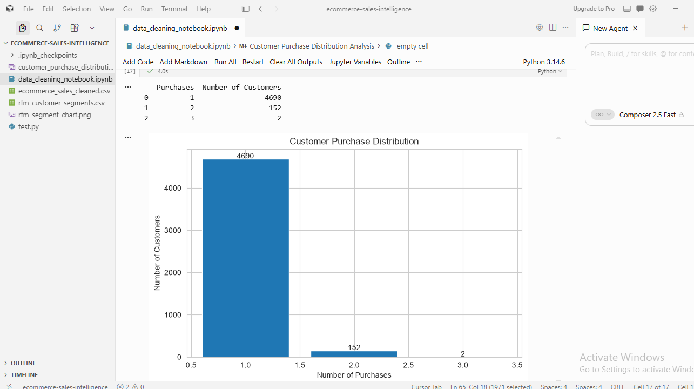

# E-Commerce Sales Intelligence
### A Revenue Operations Case Study

**Analyst:** Miracle Ezekiel  
**Tools:** Google Sheets | MySQL Workbench 8.0 CE | Python | GitHub  
**Dataset:** 5,000 transactions | October 2023 to October 2025  
**Repository Status:** ✅ Complete — All 5 Phases Published

---

## Project Overview

This is a full end-to-end data analytics portfolio project built against
a synthetic e-commerce dataset of 5,000 transactions and 4,844 unique
customers spanning two years of sales history.

The project answers one central business question:

> Why does the available customer transaction data suggest
> strong revenue alongside very limited repeat purchasing?

The analysis moves through five structured phases from raw data
cleaning through SQL analysis, Python RFM customer segmentation,
and a final published case study with CRM recommendations.

---

## Key Numbers

| Metric | Value |
|--------|-------|
| Total Revenue | 533,666,024.35 |
| Total Profit | 79,708,734.91 |
| Average Order Value | 106,733.20 |
| Average Profit Margin | 14.92% |
| Unique Customers | 4,844 |
| One-Time Customers | 4,690 (96.82%) |
| Repeat Customers | 154 (3.18%) |
| SQL Queries Written | 22 across 3 files |
| Python Cells Written | 14 cells |
| RFM Segments Created | 5 |

---

## Project Stages

| Phase | Description | Status |
|-------|-------------|--------|
| Phase 1 | Data Cleaning and Quality Assessment — full dataset audit, 5 validation checks, 4 documented issues, 5 calculated columns added | ✅ Complete |
| Phase 2 | Exploratory Data Analysis — 15 KPIs, 5 pivot tables, 5 charts, regional, category, discount and time-based analysis | ✅ Complete |
| Phase 3 | SQL Analysis and Business Intelligence — 15 KPI queries, 4 segmentation queries, 3 churn analysis queries in MySQL Workbench | ✅ Complete |
| Phase 4 | CRM and Customer Retention Analysis — RFM scoring, customer segmentation, segment chart, and prioritised customer export | ✅ Complete |
| Phase 5 | Case Study and Publishing — full written case study, GitHub publication, LinkedIn and Twitter content released | ✅ Complete |

---

## Key Findings

### Phase 1 — Data Quality Assessment

| Finding | Detail |
|---------|--------|
| Missing values | Zero across all 14 original columns |
| Duplicate records | Zero — all 5,000 Order IDs are unique |
| Sales formula accuracy | 100% — all 5,000 rows mathematically verified |
| Profit outliers | 223 transactions above IQR upper bound of 48,831.53 |
| Incomplete 2023 data | October to December only — excluded from year-over-year comparisons |
| Customer repeat rate | Below 5% — central focus of Phase 4 CRM analysis |

### Phase 2 — Exploratory Data Analysis

| Finding | Detail |
|---------|--------|
| Total revenue | 533,666,024.35 across 5,000 transactions |
| Total profit | 79,708,734.91 at 14.92% average margin |
| Average order value | 106,733.20 per transaction |
| Regional performance | North leads revenue at 26.90% — South has best margin at 14.98% |
| Strongest month | May at 9.51% of annual revenue |
| Discount impact | Average order value falls from 117,340.72 at 0% discount to 94,618.46 at 20% |

### Phase 3 — SQL Analysis

| Finding | Detail |
|---------|--------|
| Repeat purchase rate | 96.82% of all customers placed exactly one order and never returned |
| Repeat customer value | Two-order customers spend 2.03x more per lifetime. Three-order customers spend 3.88x more |
| Discount trap confirmed | 19.4% drop in average order value from zero discount to 20% discount across all 5,000 rows |
| Most profitable combination | North-Electronics at 16.23% margin — rank 1 of 40 region-category combinations |
| Least profitable combination | North-Beauty at 13.28% margin — rank 40 of 40 |
| High value transactions | 1,326 transactions (26.52% of orders) generate 56.21% of total revenue |
| Outlier impact | 223 transactions generate 16.81% of total profit from only 4.46% of all transactions |
| Worst churn region | North at 99.61% churn rate |

### Phase 4 — CRM and Customer Retention Analysis

| Segment | Customers | Revenue Share | Avg Order Value | CRM Priority |
|---------|-----------|--------------|----------------|-------------|
| Lost Customer | 2,972 (61.35%) | 53.46% | 95,997.47 | 5 — Re-engage |
| Promising | 1,543 (31.85%) | 31.05% | 107,382.27 | 4 — Nurture |
| At Risk High Value | 175 (3.61%) | 9.16% | 279,303.37 | 1 — Urgent |
| Loyal Customer | 152 (3.14%) | 6.18% | 108,439.45 | 3 — Reward |
| Champion | 2 (0.04%) | 0.15% | 137,836.50 | 2 — Protect |

---

## Additional Validation

Following constructive feedback on LinkedIn, a customer purchase distribution analysis was added to provide more context around the observed repeat purchase rate.

The distribution shows that 4,690 of the 4,844 customers made a single purchase, while only 154 customers placed more than one order.

Because this project uses a synthetic dataset, this result should be interpreted with appropriate caution. In a real business environment, validating dataset completeness, understanding the product category, and considering the expected purchase cycle would be important before drawing firm conclusions about customer retention.

---

## Repository Structure

ecommerce-sales-intelligence/
├── 01_dataset/
│   ├── README.md
│   ├── ecommerce_sales_raw.csv
│   └── ecommerce_sales_cleaned.csv
├── 02_google_sheets/
│   ├── README.md
│   ├── google_sheets_notes.md
│   └── ecommerce_sales_data_workbook.xlsx
├── 03_sql_mysql/
│   ├── README.md
│   ├── 01_schema_setup.sql
│   ├── 02_data_import_notes.md
│   ├── 04_segmentation_queries.sql
│   └── 05_churn_analysis.sql
├── 04_python/
│   ├── README.md
│   ├── notebooks/
│   │   ├── data_cleaning_notebook.ipynb
│   │   └── rfm_customer_segments.csv
│   └── scripts/
│       └── data_cleaning.py
├── 05_screenshots/
│   ├── README.md
│   ├── google_sheets/
│   ├── mysql/
│   └── python/
├── 06_case_study/
│   ├── README.md
│   ├── case_study_report.md
│   └── ECommerce_Sales_Intelligence_Case_Study.pdf
└── README.md

---

## Tools Used

| Tool | Purpose | Phase |
|------|---------|-------|
| Google Sheets | Data cleaning, EDA, pivot tables, charts | Phase 1 and 2 |
| MySQL Workbench 8.0 CE | SQL database creation and query execution | Phase 3 |
| Python in Cursor | RFM customer segmentation and visualisation | Phase 4 |
| GitHub | Version control, documentation, and publication | All phases |

---

## CRM Recommendations Summary

| Priority | Target | Action |
|----------|--------|--------|
| 1 — Urgent | 175 At Risk High Value customers | Personalised win-back outreach within 30 days |
| 2 — Protect | 2 Champion customers | VIP treatment and dedicated account contact |
| 3 — Reward | 152 Loyal Customers | Formal loyalty programme with points and early access |
| 4 — Nurture | 1,543 Promising customers | Automated 3-step email sequence post-purchase |
| 5 — Re-engage | 2,972 Lost Customers | Final re-engagement attempt before accepting churn |

---

## Case Study

The full written case study covering all findings and recommendations
is available in the `06_case_study/` folder in both Markdown and PDF format.

---

## Project Updates

### Version 1.1

Following constructive feedback on LinkedIn, this project now includes:

- Customer purchase distribution analysis.
- Additional discussion on the limitations of interpreting repeat purchase behaviour from a synthetic dataset.
- Validation notes to provide additional context before drawing customer retention conclusions.

Community feedback helped strengthen both the analysis and the interpretation of the findings.

---

## Analyst

**Miracle Ezekiel**

Virtual Assistant transitioning into Data Analytics with a focus on CRM intelligence, revenue operations, and AI supported business automation.

Background in executive assistance, customer support, and operations management, bringing direct operational context to every dataset analysed.

LinkedIn: [linkedin.com/in/miracle-ezekiel](https://linkedin.com/in/miracle-ezekiel)
